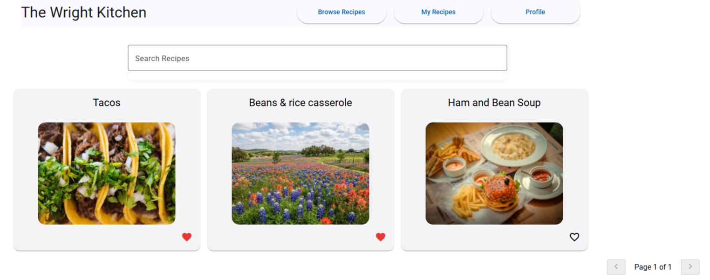
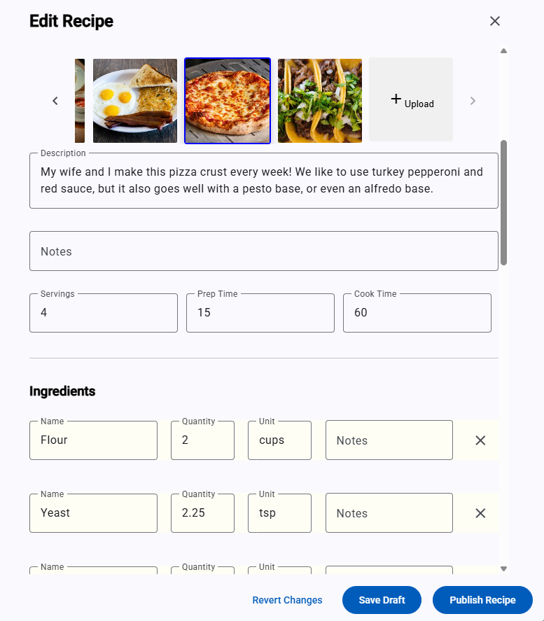
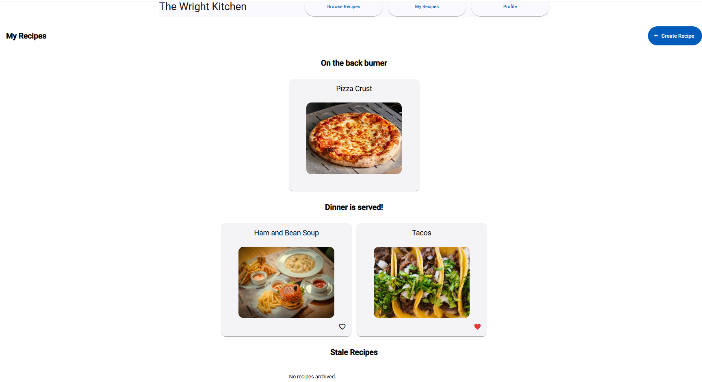
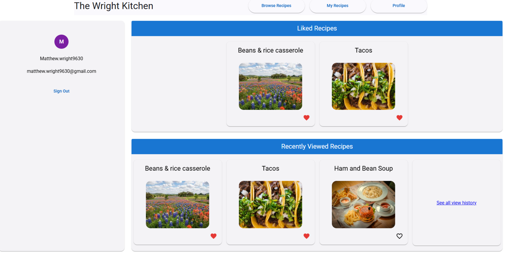
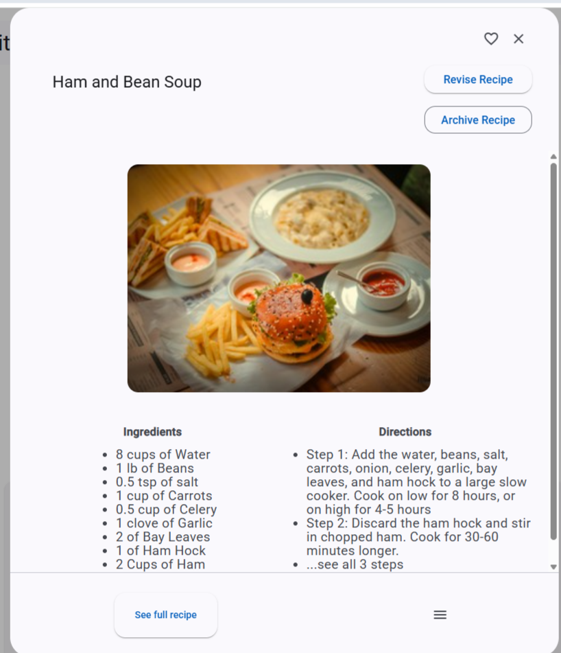
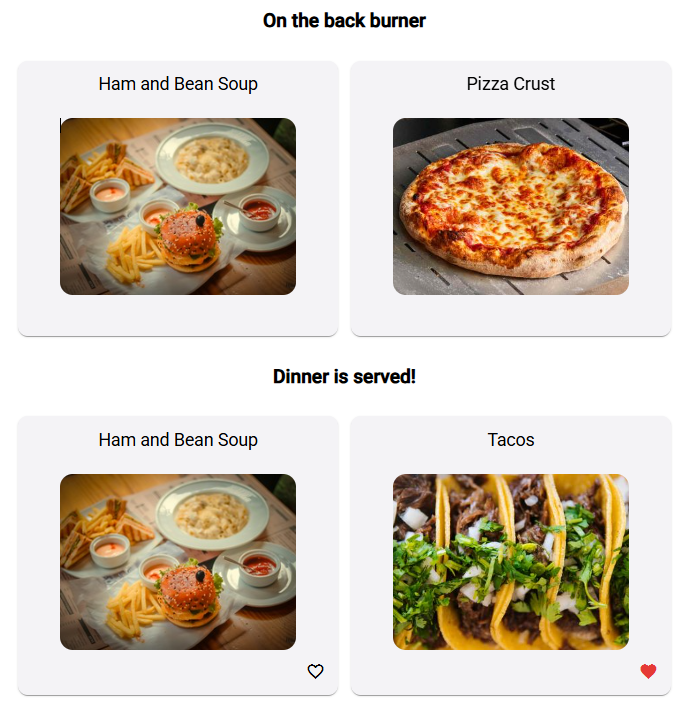

# The Wright Kitchen

A full-stack recipe management platform built with **Angular** and **Spring Boot**. The Wright Kitchen lets users create, publish, and discover recipes with a focus on clean UX and thoughtful feature design.

This project started from a simple frustration: every recipe app I tried stored recipes in one long list with no meaningful organization. I wanted a way to group recipes into collections like **Tex-Mex**, **Family Dinners**, or **Weeknight Meals** so they were actually easy to find. That idea evolved into a full-stack application that emphasizes usability, scalability, and maintainable architecture.

---

## Features

### Browse Recipes

Find what you're looking for fast, without digging through a single long list.

- Create, edit, and publish recipes
- Paginated recipe browsing with live search



### Edit Recipes

- Add ingredients, directions, prep/cook times, and images
- Upload a custom image or choose from a curated library of default images
- Recipe versioning that allows editing published recipes without affecting the live version



### Users

- Secure registration and authentication with JWT
- Personal dashboard



### Social

- Like recipes created by other users
- View recently liked and recently viewed recipes



---

## Planned Features (v2)

- 📚 **Cookbooks** — Organize recipes into named collections (Tex-Mex, Family Favorites, Weeknight Dinners, etc.) with sharing support

---

# Technical Highlights

## Recipe Versioning

Rather than treating recipes like static documents, The Wright Kitchen implements a versioning workflow designed specifically for content that evolves over time.

When a published recipe is edited:

- The published version remains visible to users
- A draft revision is created
- Once published, the previous version becomes **SUPERSEDED**
- Previous versions remain available for history while being hidden from normal browsing


_Clicking "Revise Recipe" starts a new draft._


_The recipe now exists as both a live published version and an editable draft._

This avoids the common problem where users must unpublish content just to make edits.

---

## Image Processing

Uploaded images are processed automatically using **Thumbnailator**.

For each upload the backend generates:

- Medium image
- Thumbnail image

Images are stored using a common base key, allowing the storage implementation to be swapped from local storage to Amazon S3 without changing application logic.

---

## Performance

Recipe browsing avoids the classic **N+1 query problem**.

Instead of querying likes for every recipe individually:

- Recipes are fetched as a page
- Like counts are retrieved in bulk
- Current user's liked recipes are loaded in a single query
- Results are assembled in memory before being returned

This keeps response times consistent as pages grow.

---

## Pagination & Search

Recipe browsing uses:

- Spring Data `Page<T>` for server-side pagination
- Live Angular search
- Debounced API requests to reduce unnecessary network traffic

---

# Tech Stack

| Layer             | Technology                                    |
| ----------------- | --------------------------------------------- |
| Frontend          | Angular, Angular Material                     |
| Backend           | Spring Boot, Spring Security, Spring Data JPA |
| Database          | PostgreSQL                                    |
| Authentication    | JWT                                           |
| Image Processing  | Thumbnailator                                 |
| Build Tool        | Maven                                         |
| Hosting (Planned) | AWS Lightsail, Amazon S3, CloudFront          |

---

# Running Locally

## Backend

```bash
cd recipe-backend
./mvnw spring-boot:run
```

## Frontend

```bash
cd recipe-frontend
npm install
ng serve
```

A PostgreSQL database is required.

Configure your database connection in:

```
src/main/resources/application.properties
```

---
