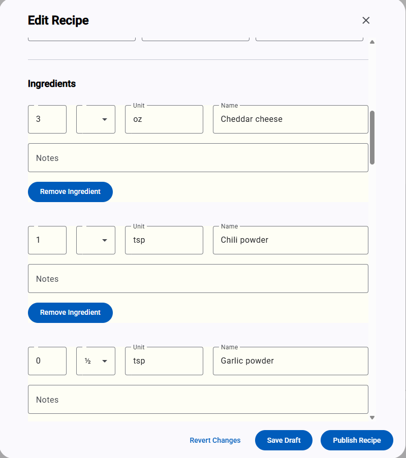
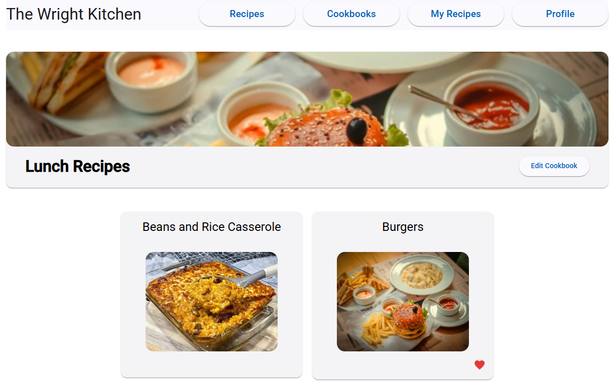
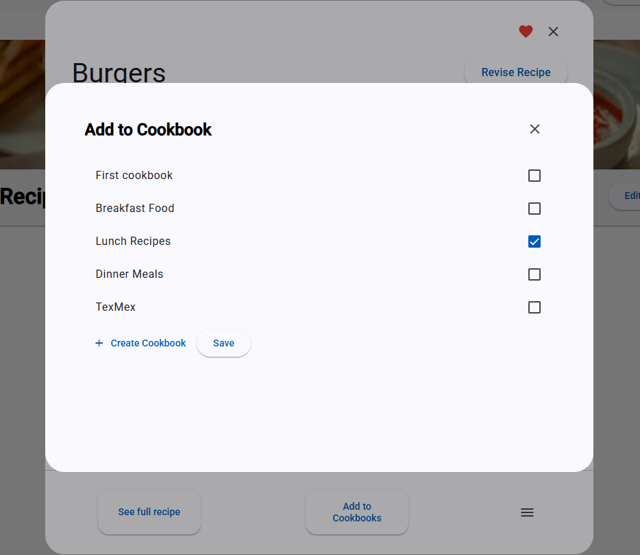
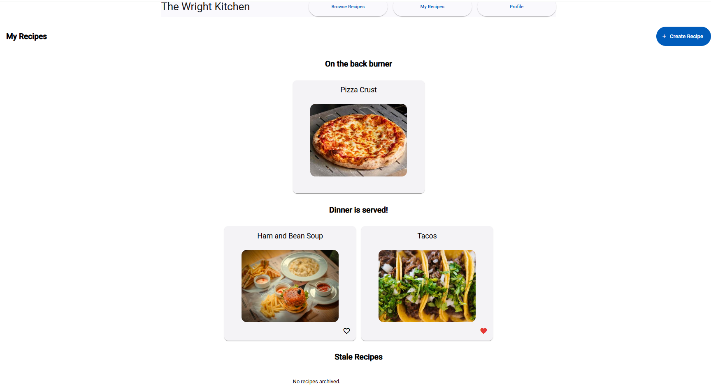
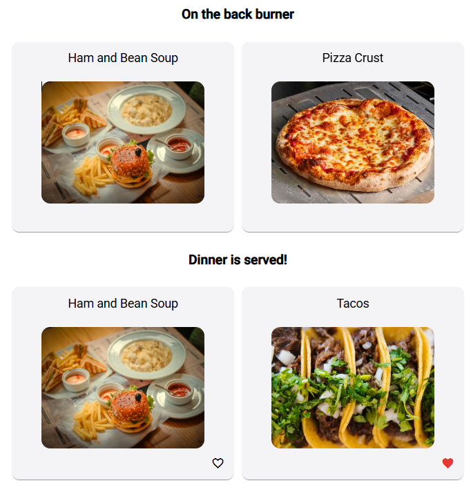
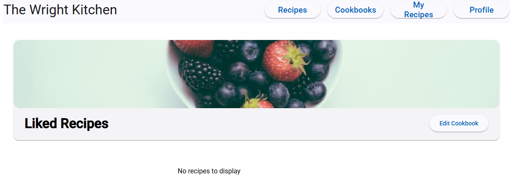
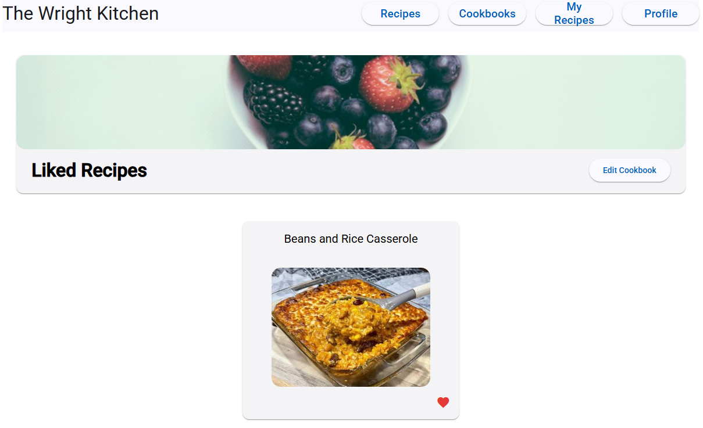
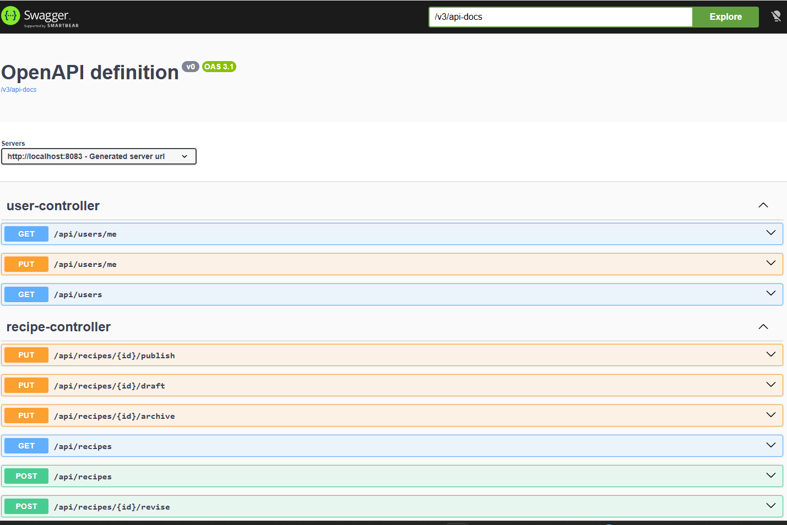

# The Wright Kitchen

**Live site:** [wrightrecipes.com](https://www.wrightrecipes.com/)

A full-stack recipe management platform built with Angular and Spring Boot.

I started this project out of frustration with my own recipe collection. Between a few different apps and websites, I had over 100 recipes saved — and no good way to actually find anything. Everything lived in one long, undifferentiated list, so "what should I make tonight" always turned into scrolling through recipes I'd forgotten I even saved. The Wright Kitchen is my attempt to fix that: a place to organize recipes into real collections — Tex-Mex, Family Dinners, Weeknight Meals — so finding the right recipe is actually fast, not a chore.

What started as "I just want to group my recipes" grew into a full-stack app, since I also wanted proper editing, versioning (so I can tweak a recipe without breaking the version I've already cooked from), image handling, and search that doesn't feel like an afterthought.

---

## Features

### Browse Recipes

Find what you're looking for fast, without digging through a single long list.

- Create, edit, and publish recipes
- Paginated recipe browsing with live search


### Create and Edit Recipes

- Add ingredients, directions, prep/cook times, and images
- Upload a custom image or choose from a curated library of default images
- Recipe versioning that allows editing published recipes without affecting the live version



### Cookbook Management

- Create cookbooks to group your favorite recipes together
  
- Easily add and remove recipes from your cookbooks
  

### Users

- Secure registration and authentication with JWT
- Personal dashboard



### Social

- Like recipes created by other users
- View recently liked and recently viewed recipes


---

## Planned Features (v3)

- 📚 **Cookbook Sharing** — Share your cookbook collections with other users

---

# Technical Highlights

## Recipe Versioning

Rather than treating recipes like static documents, The Wright Kitchen implements a versioning workflow designed specifically for content that evolves over time.

When a published recipe is edited:

- The published version remains visible to users
- A draft revision is created
- Once published, the previous version becomes **SUPERSEDED**
- Previous versions remain available for history while being hidden from normal browsing


_Clicking "Revise Recipe" starts a new draft._


_The recipe now exists as both a live published version and an editable draft._

This avoids the common problem where users must unpublish content just to make edits.

---

## Automatic Liked Recipes Management

When a user is created, a Liked Recipes cookbook is automatically created. This cookbook contains recipes the user has liked, making it easy to find favorite recipes again.
When a recipe is liked, it is automatically added to this cookbook. When a recipe is unliked, it is automatically removed.





## Image Processing

Uploaded images are processed automatically using **Thumbnailator**.

For each upload the backend generates:

- Medium image
- Thumbnail image

Images are stored using a common base key, allowing the storage implementation to be swapped from local storage to Amazon S3 without changing application logic.

---

## Performance

Recipe browsing avoids the classic **N+1 query problem**.

Instead of querying likes for every recipe individually:

- Recipes are fetched as a page
- Like counts are retrieved in bulk
- Current user's liked recipes are loaded in a single query
- Results are assembled in memory before being returned

This keeps response times consistent as pages grow.

---

## Pagination & Search

Recipe browsing uses:

- Spring Data `Page<T>` for server-side pagination
- Live Angular search
- Debounced API requests to reduce unnecessary network traffic

---

# Tech Stack

| Layer            | Technology                                    |
| ---------------- | --------------------------------------------- |
| Frontend         | Angular, Angular Material                     |
| Backend          | Spring Boot, Spring Security, Spring Data JPA |
| Database         | PostgreSQL                                    |
| Authentication   | JWT                                           |
| Image Processing | Thumbnailator                                 |
| Build Tool       | Maven                                         |
| Hosting          | AWS Lightsail, Amazon S3, Cloudflare          |

---

# Running Locally

## Backend

```bash
cd recipe-backend
./mvnw spring-boot:run
```

## Frontend

```bash
cd recipe-frontend
npm install
ng serve
```

A PostgreSQL database is required.

Configure your database connection in:

```
src/main/resources/application.properties
```

---

## API Documentation

The backend API is documented using OpenAPI/Swagger.

When running the application locally, Swagger UI is available at: http://localhost:8083/swagger-ui/index.html
The OpenAPI specification can be accessed at: http://localhost:8083/v3/api-docs


