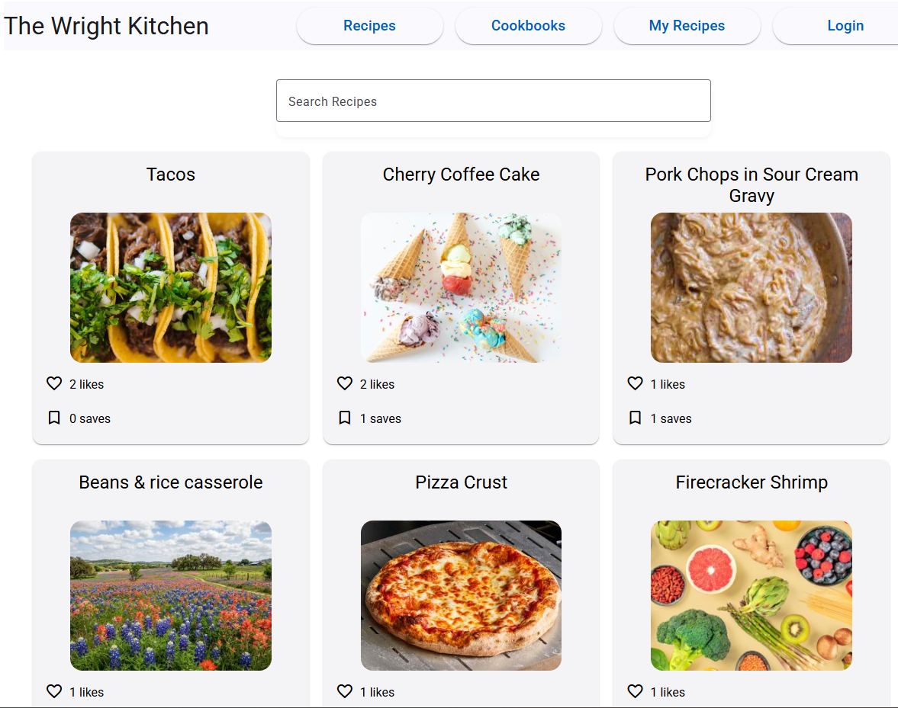
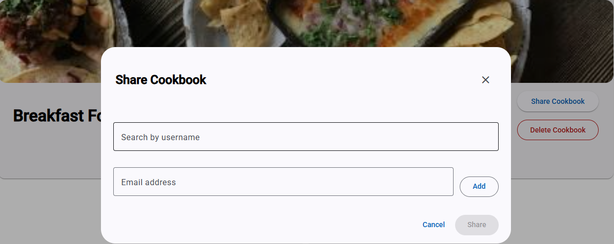
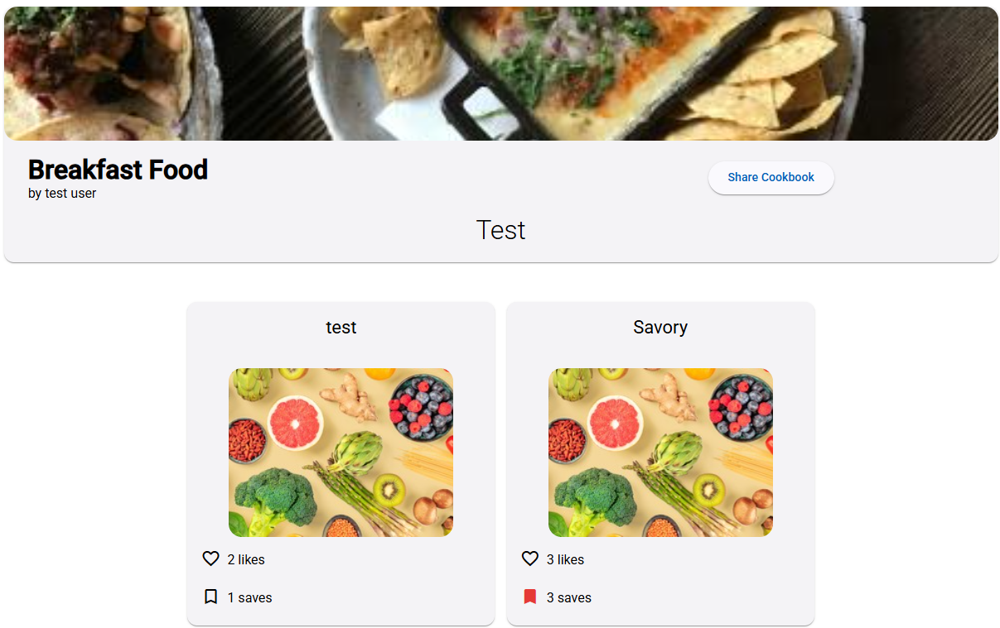
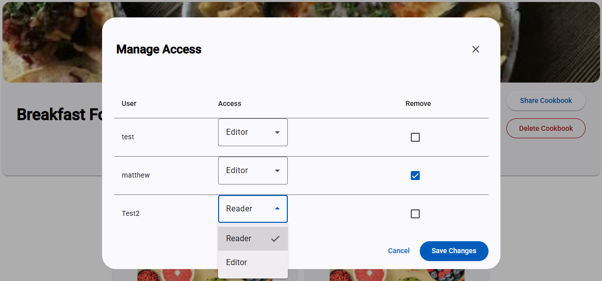
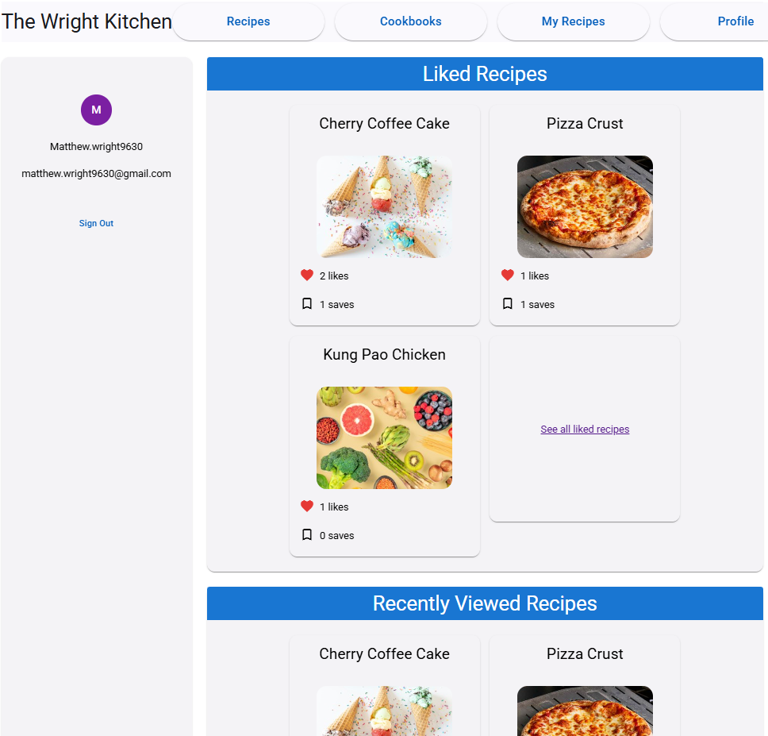
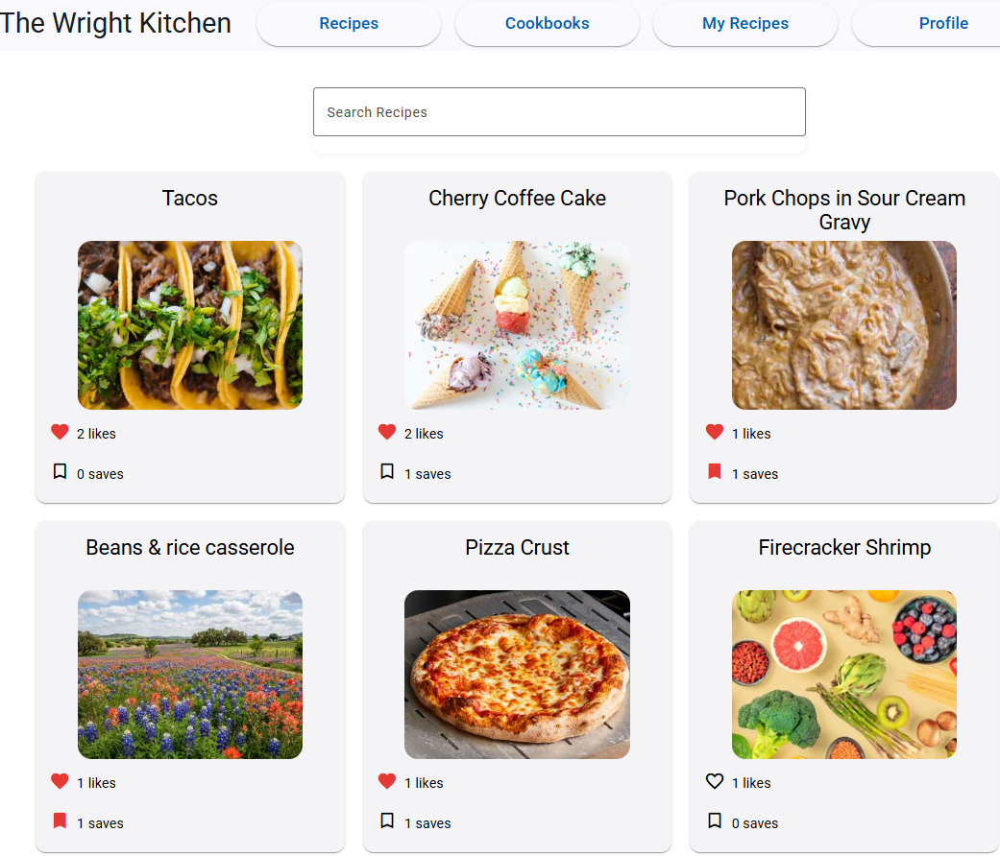
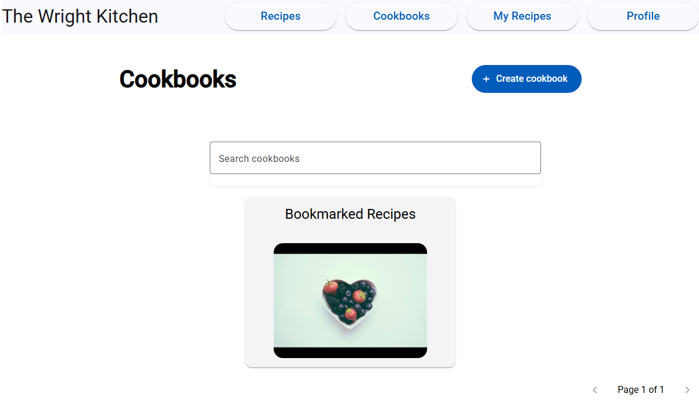
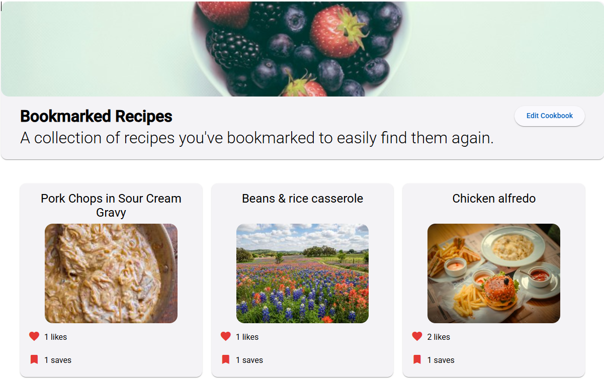

# The Wright Kitchen

**Live site:** [wrightrecipes.com](https://www.wrightrecipes.com/)

A full-stack recipe management platform built with Angular and Spring Boot.

I started this project out of frustration with my own recipe collection. Between a few different apps and websites, I had over 100 recipes saved — and no good way to actually find anything. Everything lived in one long, undifferentiated list, so "what should I make tonight" always turned into scrolling through recipes I'd forgotten I even saved. The Wright Kitchen is my attempt to fix that: a place to organize recipes into real collections — Tex-Mex, Family Dinners, Weeknight Meals — so finding the right recipe is actually fast, not a chore.

What started as "I just want to group my recipes" grew into a full-stack app. I wanted to include editing and versioning recipes, adding images, searching, and sharing.

---

## Features

### Browse Recipes

Find what you're looking for fast, without digging through a single long list.

- Create, edit, and publish recipes
- Paginated recipe browsing with live search



### Create and Edit Recipes

- Add ingredients, directions, prep/cook times, and images
- Upload a custom image or choose from a curated library of default images
- Recipe versioning that allows editing published recipes without affecting the live version


### Cookbook Management

- Create cookbooks to group your favorite recipes together
  
- Easily add and remove recipes from your cookbooks
  

### Cookbook Collaboration

Cookbooks can be shared with other users, allowing multiple users to collaborate on the same collection of recipes.

- Share cookbooks with other registered users
- Owners have full control over the cookbook details, cookbook recipes, and who has access
- Editors can add recipes to the cookbook and share the cookbook with additional users
- Viewers can access the cookbook without making changes
  
  
  

### Users

- Secure registration and authentication with JWT
- Personal dashboard


- Profile page includes all liked recipes and all recently viewed recipes.



### Social

- Like recipes created by other users
- Bookmark recipes you want to try later, or ones you really enjoy!

## 

## Planned Features

- 📚 **Cookbook Link** — Create a read-only link for easy sharing.
- **Notifications** - Notify users when a cookbook has been shared with them or their access has changed.

---

# Technical Highlights

## Recipe Versioning

Rather than treating recipes like static documents, The Wright Kitchen implements a versioning workflow designed specifically for content that evolves over time.

When a published recipe is edited:

- The published version remains visible to users
- A draft revision is created
- Once published, the previous version becomes **SUPERSEDED**
- Previous versions remain available for history while being hidden from normal browsing


_Clicking "Revise Recipe" starts a new draft._


_The recipe now exists as both a live published version and an editable draft._

This avoids the common problem where users must unpublish content just to make edits.

---

## Bookmarking Recipes

When a user is created, a Bookmarked Recipes cookbook is automatically created. This cookbook is tied to the "bookmark" action on recipes, making it easier to find recipes you want to come back to.





## Image Processing

Uploaded images are processed automatically using **Thumbnailator**.

For each upload the backend generates:

- Medium image
- Thumbnail image

Images are stored using a common base key, allowing the storage implementation to be swapped from local storage to Amazon S3 without changing application logic.

---

## Performance

Recipe browsing avoids the classic **N+1 query problem**.

Instead of querying likes for every recipe individually:

- Recipes are fetched as a page
- Like counts are retrieved in bulk
- Current user's liked recipes are loaded in a single query
- Results are assembled in memory before being returned

This keeps response times consistent as pages grow.

---

## Pagination & Search

Recipe browsing uses:

- Spring Data `Page<T>` for server-side pagination
- Live Angular search
- Debounced API requests to reduce unnecessary network traffic

---

## Cookbook Authorization & Collaboration

Cookbook sharing is implemented with role-based access control rather than treating a shared cookbook as simply public or private.

Each cookbook can have multiple users with different levels of access:

| Role   | Permissions                                                              |
| ------ | ------------------------------------------------------------------------ |
| Owner  | Full control of the cookbook, including managing recipes and user access |
| Editor | Add recipes to a cookbook and can grant read-only access to users        |
| Viewer | View the cookbook and its recipes without making changes                 |

Authorization is enforced on the backend, so permissions are not dependent on the frontend hiding or disabling UI controls.

When a user accesses a shared cookbook, the backend determines their relationship to the cookbook and applies the appropriate permissions before allowing the requested operation. This allows the same cookbook to support both individual ownership and collaborative access without duplicating cookbook data.

---

## Sharing & Account Privacy

The cookbook sharing workflow supports two ways to find recipients:

- **Search by username** — results show matching usernames, and clicking a name confirms whether that user already has access to the cookbook
- **Search by exact email** — if a matching account exists, access is granted directly; if not, the request is silently ignored

The email flow is intentionally quiet by design: returning "no account found" would let someone probe for which email addresses have accounts on the platform, so the response looks the same whether the account exists or not.

---

# Tech Stack

| Layer            | Technology                                    |
| ---------------- | --------------------------------------------- |
| Frontend         | Angular, Angular Material                     |
| Backend          | Spring Boot, Spring Security, Spring Data JPA |
| Database         | PostgreSQL                                    |
| Authentication   | JWT                                           |
| Image Processing | Thumbnailator                                 |
| Build Tool       | Maven                                         |
| Hosting          | AWS Lightsail, Amazon S3, Cloudflare          |

---

# Running Locally

## Backend

```bash
cd recipe-backend
./mvnw spring-boot:run
```

## Frontend

```bash
cd recipe-frontend
npm install
ng serve
```

A PostgreSQL database is required.

Configure your database connection in:

```
src/main/resources/application.properties
```

---

## API Documentation

The backend API is documented using OpenAPI/Swagger.

When running the application locally, Swagger UI is available at: http://localhost:8083/swagger-ui/index.html
The OpenAPI specification can be accessed at: http://localhost:8083/v3/api-docs


